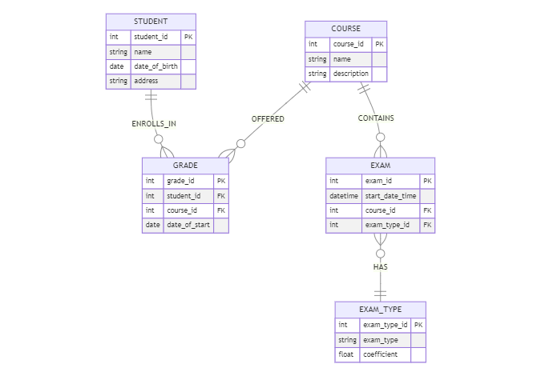

# Entity Relationship Diagram (ERD)

Hãy thiết kế bảng tuần thủ tất cả các luật chuẩn hoá và đáp ứng nghiệp vụ sau:

- Trong một lớp học, sinh viên (Student) có thể tuỳ chọn tham gia nhiều khoá học (Course)
- Một khoá học có nhiều hơn 1 sinh viên tham gia
- Trong một khoá học có nhiều bài kiểm tra
- Có 4 loại kiểm tra ứng với các hệ số điểm khác nhau
- Điểm trong dải từ 0 đến 10, có thể có 1 chữ số thập phân sau dấy phẩy ví dụ 8.5
- Cần lưu ngày, giờ bắt đầu bài kiểm tra

### Sinh viên cần:

- Vẽ biểu đồ quan hệ ER Diagram định dạng Mermaid kèm giải thích
- Viết câu lệnh DDL để sinh các bảng
- Chèn dữ liệu mẫu

## ERD Diagram



## Entity

- **STUDENT**: Thực thể "STUDENT" biểu thị thông tin về sinh viên, bao gồm "student_id" (mã sinh viên), "name" (tên), "
  date_of_birth" (ngày tháng năm sinh), và "address" (địa chỉ).

- **COURSE**: Thực thể "COURSE" biểu thị thông tin về khoá học, bao gồm "course_id" (mã khoá học), "name" (tên khoá học)
  , và "description" (mô tả).

- **EXAM**: Thực thể "EXAM" biểu thị thông tin về các bài kiểm tra trong hệ thống, bao gồm "exam_id" (mã bài kiểm tra)
  , "start_date_time" (ngày và giờ bắt đầu), "course_id" (mã khoá học liên quan), và "exam_type_id" (loại bài kiểm tra).

- **EXAM_TYPE**: Thực thể "EXAM_TYPE" biểu thị các loại bài kiểm tra khả dụng, bao gồm "exam_type_id" (mã loại), "
  exam_type" (tên loại), và "coefficient" (hệ số điểm số).

- **GRADE**: Thực thể GRADE biểu thị quá trình đăng ký của sinh viên vào khoá học cụ thể, bao gồm "enrollment_id" (mã
  đăng ký), "student_id" (mã sinh viên), "course_id" (mã khoá học), và "date_of_start" (ngày bắt đầu đăng ký).

## Relationships

- **Mối quan hệ "STUDENT ||--o{ GRADE : ENROLLS_IN"**:  biểu thị rằng một sinh viên có thể đăng ký cho nhiều khoá học.
- **Mối quan hệ "COURSE ||--o{ GRADE : OFFERED"**: biểu thị rằng một khoá học có thể được đăng ký bởi nhiều sinh viên.
- **Mối quan hệ "COURSE ||--o{ EXAM : CONTAINS"**: biểu thị rằng một khoá học có thể chứa nhiều bài kiểm tra.
- **Mối quan hệ "EXAM }o--|| EXAM_TYPE : HAS"**: biểu thị rằng mỗi bài kiểm tra có một loại bài kiểm tra tương ứng.

## Mermaid v10.5.0

```
erDiagram
    STUDENT ||--o{ GRADE : ENROLLS_IN
    COURSE ||--o{ GRADE : OFFERED
    COURSE ||--o{ EXAM : CONTAINS
    EXAM }o--|| EXAM_TYPE : HAS
    
    EXAM {
        int exam_id PK
        datetime start_date_time
        int course_id FK
        int exam_type_id FK
    }
    EXAM_TYPE {
        int exam_type_id PK
        string exam_type
        float coefficient
    }
    COURSE {
        int course_id PK
        string name
        string description
    }
    STUDENT {
        int student_id PK
        string name
        date date_of_birth
        string address
    }
    GRADE {
        int grade_id PK
        int student_id FK
        int course_id FK
        date date_of_start
    }

```

## DDL

```sql
CREATE DATABASE SCHOOL;
USE SCHOOL;
CREATE TABLE STUDENT
(
    student_id    INT PRIMARY KEY,
    name          VARCHAR(255),
    date_of_birth DATE,
    address       VARCHAR(255)
);

CREATE TABLE COURSE
(
    course_id   INT PRIMARY KEY,
    name        VARCHAR(255),
    description VARCHAR(255)
);
CREATE TABLE EXAM_TYPE
(
    exam_type_id INT PRIMARY KEY,
    exam_type    VARCHAR(255),
    coefficient  FLOAT
);
CREATE TABLE EXAM
(
    exam_id         INT PRIMARY KEY,
    start_date_time DATETIME,
    course_id       INT,
    exam_type_id    INT,
    FOREIGN KEY (course_id) REFERENCES COURSE (course_id),
    FOREIGN KEY (exam_type_id) REFERENCES EXAM_TYPE (exam_type_id)
);
CREATE TABLE GRADE
(
    grade_id INT PRIMARY KEY,
    student_id    INT,
    course_id     INT,
    date_of_start DATE,
    FOREIGN KEY (student_id) REFERENCES STUDENT (student_id),
    FOREIGN KEY (course_id) REFERENCES COURSE (course_id)
);

```

## DATA

```sql
INSERT INTO STUDENT (student_id, name, date_of_birth, address)
VALUES
    (1, 'Nguyễn Văn A', '2000-01-01', 'Hà Nội'),
    (2, 'Trần Thị B', '1999-05-15', 'Hồ Chí Minh'),
    (3, 'Lê Văn C', '2001-08-20', 'Đà Nẵng');

INSERT INTO COURSE (course_id, name, description)
VALUES
    (101, 'Toán cơ bản', 'Khóa học về toán học cơ bản'),
    (102, 'Lập trình Java', 'Khóa học về lập trình Java'),
    (103, 'Kỹ thuật nghiên cứu', 'Khóa học về kỹ thuật nghiên cứu');
INSERT INTO EXAM_TYPE (exam_type_id, exam_type, coefficient)
VALUES
    (1, 'Kiểm tra 15p', 1.0),
    (2, 'Kiểm tra 45p', 2.0),
    (3, 'Thực hành 3 tiếng', 4.0),
    (4, 'Kiểm tra cuối khoá / đồ án', 8.0);
INSERT INTO EXAM (exam_id, start_date_time, course_id, exam_type_id)
VALUES
    (201, '2023-05-10 08:00:00', 101, 1),
    (202, '2023-06-15 14:30:00', 102, 2),
    (203, '2023-07-20 09:00:00', 102, 4),
    (204, '2023-08-05 10:30:00', 103, 3);
INSERT INTO GRADE (grade_id, student_id, course_id, date_of_start)
VALUES
    (301, 1, 101, '2023-05-10'),
    (302, 2, 102, '2023-06-15'),
    (303, 3, 102, '2023-06-15'),
    (304, 1, 103, '2023-08-05');

```