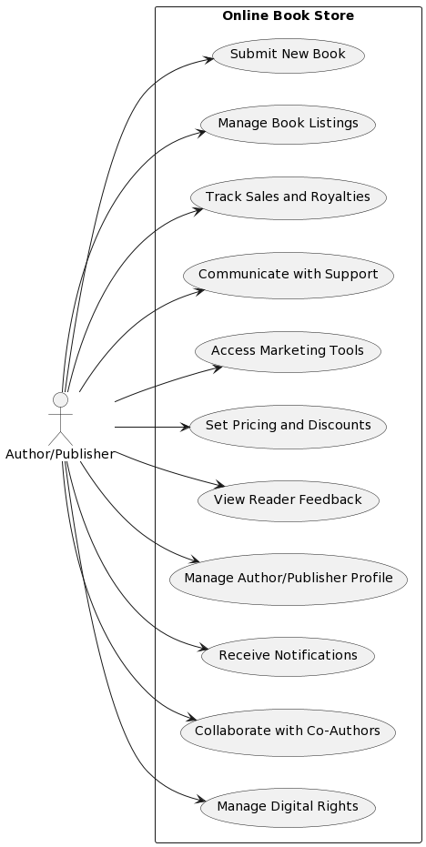
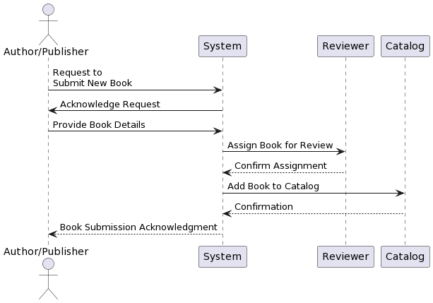
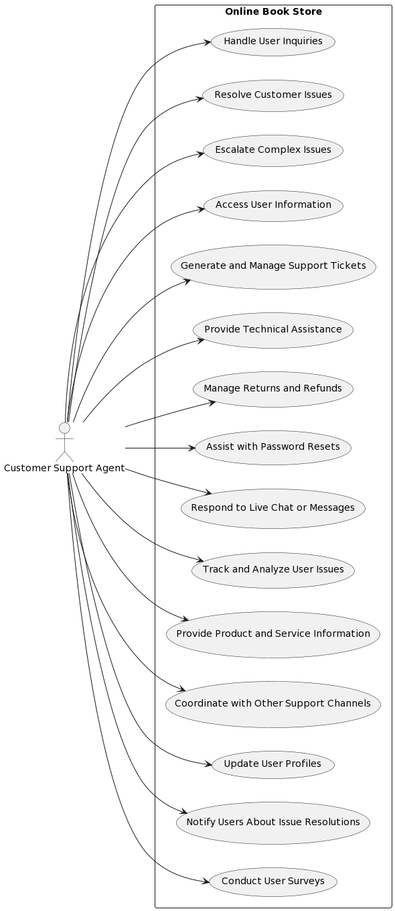
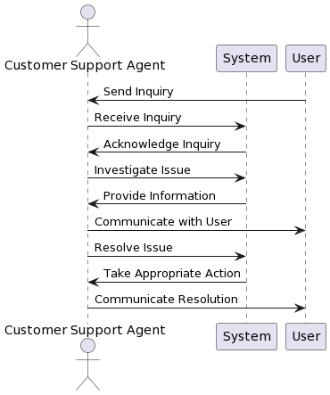
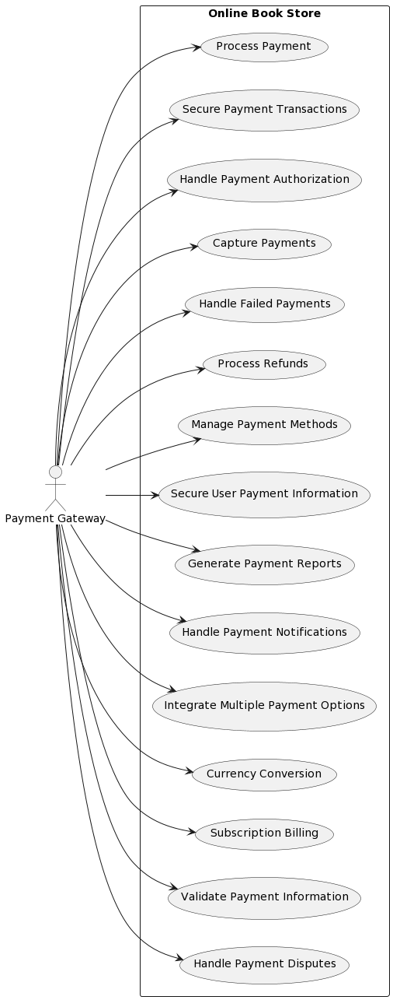
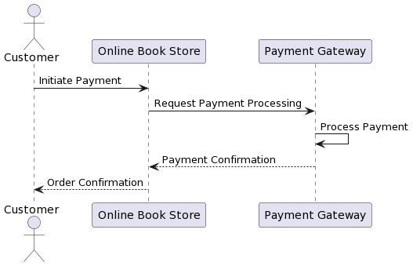
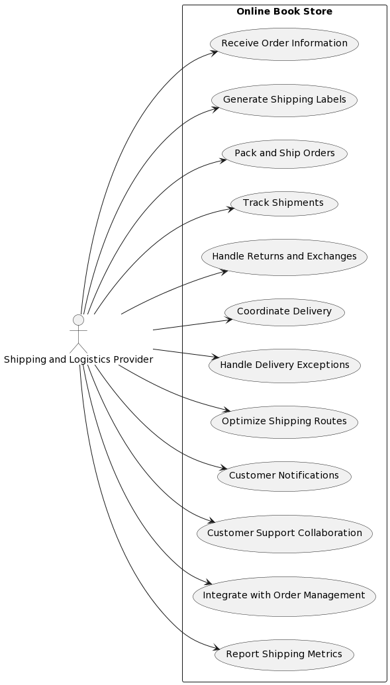
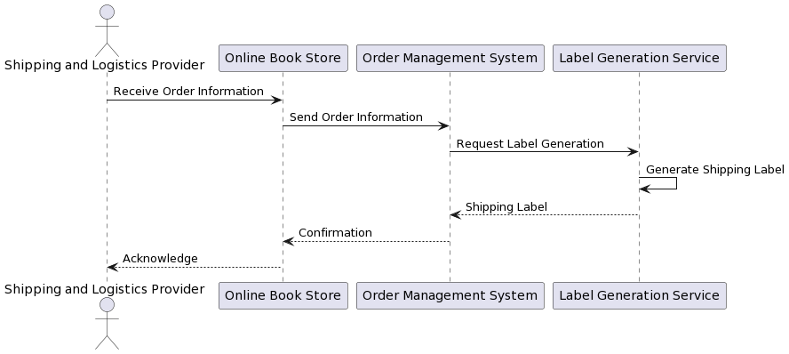

## Develop a online book store
Customer buy books online, store will ship books to customer’s door. Customer may borrow paper books as long as he/she deposit amount of money. Customer can subscribe monthly or annually to listen audio books and read digital book online or digital book reader. The web site should serve up to 20 millions customers and 5000 concurrent customers. I want to implement whole system in micro-services architect. Please help to define key business logics and features.

Hiện còn các role này chưa thiết kế UML User Case, bạn hãy ra lệnh cho ChatGPT sinh mô tả User Case và xuất sơ đồ

- Authors and Publishers: Users who are part of the book industry and want to promote their books on your platform. They can submit their books for approval and receive royalties for sales or subscriptions.
- Customer Support Agents: Users who are responsible for providing customer support, handling inquiries, and resolving issues. They can access a ticketing system or live chat to communicate with users and escalate issues to higher-level support if needed.
- Payment Gateways: Users who are third-party providers that handle the processing of payments from users. They can integrate with your system to allow users to pay for their purchases and subscriptions securely.
- Shipping and Logistics Providers: Users who are third-party providers that handle the shipping and delivery of physical books to users. They can integrate with your system to generate shipping labels, track shipments, and provide real-time updates to users.

### Authors and Publishers
#### Usecase
```
ASK: List all UML user cases of Authors and Publishers
```
Here is a list of potential UML use cases for Authors and Publishers in your online book store system:

1. **Submit New Book**:
    - Authors and Publishers can submit new books to the system for review and inclusion in the catalog.

2. **Manage Book Listings**:
    - Users in this role can edit, update, or delete book listings they've submitted.

3. **Track Sales and Royalties**:
    - Authors and Publishers can access information about the sales of their books and view royalty earnings.

4. **Communicate with Support**:
    - They can contact customer support for inquiries, issues, or assistance related to their book listings or royalties.

5. **Access Marketing Tools**:
    - This role may provide access to marketing and promotion tools to help authors and publishers promote their books.

6. **Set Pricing and Discounts**:
    - Users in this role can set prices and apply discounts to their books in the catalog.

7. **View Reader Feedback**:
    - Authors and Publishers can view feedback and reviews from readers about their books.

8. **Manage Author/Publisher Profile**:
    - Users in this role can maintain their author or publisher profiles, including bio, photo, and contact information.

9. **Receive Notifications**:
    - They can opt to receive notifications about book sales, reviews, and other relevant events.

10. **Collaborate with Co-Authors**:
    - If applicable, this use case allows authors to collaborate with co-authors and manage joint book submissions.

11. **Manage Digital Rights**:
    - If applicable, users in this role can define and manage digital rights for their digital books.


```
ASK: can you generate about UML user cases in PlantUML?
```
```
@startuml
left to right direction
skinparam packageStyle rectangle

actor "Author/Publisher" as AuthorPublisher

rectangle "Online Book Store" {
  AuthorPublisher --> (Submit New Book)
  AuthorPublisher --> (Manage Book Listings)
  AuthorPublisher --> (Track Sales and Royalties)
  AuthorPublisher --> (Communicate with Support)
  AuthorPublisher --> (Access Marketing Tools)
  AuthorPublisher --> (Set Pricing and Discounts)
  AuthorPublisher --> (View Reader Feedback)
  AuthorPublisher --> (Manage Author/Publisher Profile)
  AuthorPublisher --> (Receive Notifications)
  AuthorPublisher --> (Collaborate with Co-Authors)
  AuthorPublisher --> (Manage Digital Rights)
}
@enduml

```

Author & Publisher Usecase Diagram

#### Sequence diagram
```
ASK: Can you generate UML sequence diagram of  **Submit New Book**:
```
```
@startuml
actor "Author/Publisher" as AuthorPublisher
participant "System" as System
participant "Reviewer" as Reviewer
participant "Catalog" as Catalog

AuthorPublisher -> System: Request to\nSubmit New Book
System -> AuthorPublisher: Acknowledge Request
AuthorPublisher -> System: Provide Book Details
System -> Reviewer: Assign Book for Review
Reviewer --> System: Confirm Assignment
System -> Catalog: Add Book to Catalog
Catalog --> System: Confirmation
System --> AuthorPublisher: Book Submission Acknowledgment

@enduml

```

Submit New Book

### Customer Support Agents
#### Usecase
```
ASK: List all UML user cases of Customer Support Agents
```
Here is a list of potential UML use cases for Customer Support Agents in your online book store system:

1. **Handle User Inquiries**:
    - Customer Support Agents can respond to user inquiries related to orders, account issues, or general questions.

2. **Resolve Customer Issues**:
    - Agents have the authority to resolve customer issues, including problems with purchases, refunds, or content access.

3. **Escalate Complex Issues**:
    - When an issue cannot be resolved at the initial support level, agents can escalate it to higher-level support or administrators.

4. **Access User Information**:
    - Agents can access user account information and order history to assist with problem-solving.

5. **Generate and Manage Support Tickets**:
    - Agents can create and manage support tickets to track and prioritize user issues efficiently.

6. **Provide Technical Assistance**:
    - Agents offer technical assistance to users facing difficulties with the website, app, or digital content.

7. **Manage Returns and Refunds**:
    - Customer Support Agents handle return requests, refunds, and related financial transactions.

8. **Assist with Password Resets**:
    - Agents help users with password reset requests or account recovery.

9. **Respond to Live Chat or Messages**:
    - Agents communicate with users through live chat or messaging for real-time support.

10. **Track and Analyze User Issues**:
    - Agents may monitor and analyze common user issues to identify trends and provide feedback for system improvement.

11. **Provide Product and Service Information**:
    - Agents are knowledgeable about the products and services offered and can provide users with information or recommendations.

12. **Coordinate with Other Support Channels**:
    - Agents collaborate with email support, phone support, or other support channels for comprehensive assistance.

13. **Update User Profiles**:
    - Agents can assist users with updating their profiles, contact information, or preferences.

14. **Notify Users About Issue Resolutions**:
    - After resolving issues, agents can notify users of the resolution and any follow-up steps.

15. **Conduct User Surveys**:
    - Agents may request user feedback through surveys to evaluate and improve customer support services.

```
ASK: can you generate about UML user cases in PlantUML?
```
```uml
@startuml
left to right direction
skinparam packageStyle rectangle

actor "Customer Support Agent" as Agent

rectangle "Customer Support System" {
  Agent --> (Handle User Inquiries)
  Agent --> (Resolve Customer Issues)
  Agent --> (Escalate Complex Issues)
  Agent --> (Access User Information)
  Agent --> (Generate and Manage Support Tickets)
  Agent --> (Provide Technical Assistance)
  Agent --> (Manage Returns and Refunds)
  Agent --> (Assist with Password Resets)
  Agent --> (Respond to Live Chat or Messages)
  Agent --> (Track and Analyze User Issues)
  Agent --> (Provide Product and Service Information)
  Agent --> (Coordinate with Other Support Channels)
  Agent --> (Update User Profiles)
  Agent --> (Notify Users About Issue Resolutions)
  Agent --> (Conduct User Surveys)
}
@enduml

```

Customer Support Usecase Diagram

#### Sequence diagram
```
ASK: Can you generate UML sequence diagram of Handle User Inquiries & Resolve Customer Issues
```
```
@startuml
actor "Customer Support Agent" as Agent
participant "System" as System
participant "User" as User

User -> Agent: Send Inquiry
Agent -> System: Receive Inquiry
System -> Agent: Acknowledge Inquiry

Agent -> System: Investigate Issue
System -> Agent: Provide Information
Agent -> User: Communicate with User

Agent -> System: Resolve Issue
System -> Agent: Take Appropriate Action
Agent -> User: Communicate Resolution

@enduml


```

Handle User Inquiries

### Customer Support Agents
#### Usecase

```
ASK: List all UML user cases of Payment Gateways function
```
Here is a list of potential UML use cases for Payment Gateways in your online book store system:

1. **Process Payment**:
    - Payment Gateways can process payments made by customers for book purchases and subscription fees.

2. **Secure Payment Transactions**:
    - Ensure that payment transactions are secure and comply with industry standards and regulations, such as PCI DSS.

3. **Handle Payment Authorization**:
    - Authorize payment transactions, ensuring that the customer has sufficient funds or credit available for the purchase.

4. **Capture Payments**:
    - Capture the payment amount after authorization and confirm the completion of the transaction.

5. **Handle Failed Payments**:
    - Manage situations where payments are declined, and communicate error messages to customers.

6. **Process Refunds**:
    - Support the processing of refunds in cases of returns, cancellations, or disputes.

7. **Manage Payment Methods**:
    - Allow users to add, update, or delete payment methods associated with their accounts.

8. **Secure User Payment Information**:
    - Safeguard customer payment data and maintain data security standards.

9. **Generate Payment Reports**:
    - Create reports that track payment transactions, revenue, and other financial metrics.

10. **Handle Payment Notifications**:
    - Receive and process payment notifications or callbacks from payment processors.

11. **Integrate Multiple Payment Options**:
    - Integrate various payment methods, including credit/debit cards, digital wallets, and other forms of payment.

12. **Currency Conversion**:
    - Provide currency conversion services for international customers.

13. **Subscription Billing**:
    - Manage recurring subscription billing for customers who have subscribed to services on a periodic basis.

14. **Validate Payment Information**:
    - Verify the accuracy and validity of payment information provided by users.

15. **Handle Payment Disputes**:
    - Assist in the resolution of payment disputes or chargebacks initiated by customers.

```
ASK: can you generate about UML user cases in PlantUML?
```
``` 
@startuml
left to right direction
skinparam packageStyle rectangle

actor "Payment Gateway" as Gateway

rectangle "Payment Processing" {
  Gateway --> (Process Payment)
  Gateway --> (Secure Payment Transactions)
  Gateway --> (Handle Payment Authorization)
  Gateway --> (Capture Payments)
  Gateway --> (Handle Failed Payments)
  Gateway --> (Process Refunds)
  Gateway --> (Manage Payment Methods)
  Gateway --> (Secure User Payment Information)
  Gateway --> (Generate Payment Reports)
  Gateway --> (Handle Payment Notifications)
  Gateway --> (Integrate Multiple Payment Options)
  Gateway --> (Currency Conversion)
  Gateway --> (Subscription Billing)
  Gateway --> (Validate Payment Information)
  Gateway --> (Handle Payment Disputes)
}
@enduml

```


Payment Processing Usecase Diagram

#### Sequence diagram
```
ASK: Can you generate UML sequence diagram of Process Payment
```
```
@startuml
actor "Customer" as Customer
participant "Online Book Store" as BookStore
participant "Payment Gateway" as PaymentGateway

Customer -> BookStore: Initiate Payment
BookStore -> PaymentGateway: Request Payment Processing
PaymentGateway -> PaymentGateway: Process Payment
PaymentGateway --> BookStore: Payment Confirmation
BookStore --> Customer: Order Confirmation

@enduml


```

Handle User Inquiries

### Shipping and Logistics Providers
#### Usecase


```
ASK: List all UML user cases of  Shipping and Logistics Providers in Online Book Store
```
Here is a list of potential UML use cases for Shipping and Logistics Providers in your online book store:

1. **Receive Order Information**:
    - Shipping and Logistics Providers receive order details, including the book(s) to be shipped, customer information, and shipping addresses.

2. **Generate Shipping Labels**:
    - Generate shipping labels and tracking information for orders to be shipped.

3. **Pack and Ship Orders**:
    - Physically package and ship the ordered paper books to the customers' addresses.

4. **Track Shipments**:
    - Monitor and track the status and location of shipped orders to provide real-time updates to customers.

5. **Handle Returns and Exchanges**:
    - Manage the process of customers returning books, including issuing return labels and processing exchanges or refunds.

6. **Coordinate Delivery**:
    - Coordinate with local carriers and delivery personnel to ensure timely and accurate book deliveries.

7. **Handle Delivery Exceptions**:
    - Address delivery exceptions, such as failed delivery attempts or address issues, and communicate with customers to resolve problems.

8. **Optimize Shipping Routes**:
    - Optimize delivery routes to minimize shipping costs and delivery times.

9. **Customer Notifications**:
    - Provide notifications and alerts to customers about order shipments, expected delivery dates, and any delays.

10. **Customer Support Collaboration**:
    - Collaborate with customer support agents to resolve delivery-related inquiries or issues.

11. **Integrate with Order Management**:
    - Integrate with the order management system to ensure accurate and synchronized order processing.

12. **Report Shipping Metrics**:
    - Provide reports and metrics on shipping performance, including delivery times and delivery success rates.

``` 
ASK: can you generate about UML user cases in PlantUML?
```
``` 
@startuml
left to right direction
skinparam packageStyle rectangle

actor "Shipping and Logistics Provider" as Provider

rectangle "Shipping and Logistics" {
  Provider --> (Receive Order Information)
  Provider --> (Generate Shipping Labels)
  Provider --> (Pack and Ship Orders)
  Provider --> (Track Shipments)
  Provider --> (Handle Returns and Exchanges)
  Provider --> (Coordinate Delivery)
  Provider --> (Handle Delivery Exceptions)
  Provider --> (Optimize Shipping Routes)
  Provider --> (Customer Notifications)
  Provider --> (Customer Support Collaboration)
  Provider --> (Integrate with Order Management)
  Provider --> (Report Shipping Metrics)
}
@enduml

```

Shipping and Logistics Provider Usecase Diagram

#### Sequence diagram
```
ASK: Can you generate UML sequence diagram of Receive Order Information & Generate Shipping Labels
```
```
@startuml
actor "Shipping and Logistics Provider" as Provider
participant "Online Book Store" as BookStore
participant "Order Management System" as OrderSystem
participant "Label Generation Service" as LabelService

Provider -> BookStore: Receive Order Information
BookStore -> OrderSystem: Send Order Information
OrderSystem -> LabelService: Request Label Generation
LabelService -> LabelService: Generate Shipping Label
LabelService --> OrderSystem: Shipping Label
OrderSystem --> BookStore: Confirmation
BookStore --> Provider: Acknowledge

@enduml


```


Shipping and Logistics Provider Sequence Diagram
